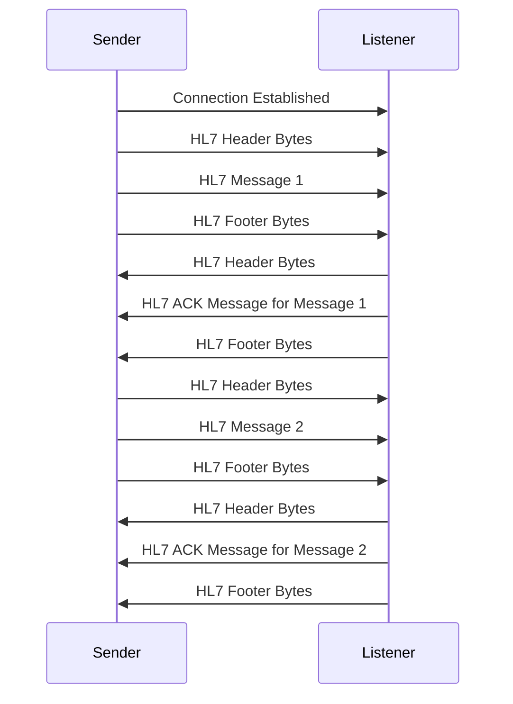

+++
title = "HL7 Protocol"
weight = 40
+++

HL7 is a protocol on top of TCP/IP.  A sending system makes a connection to a known receiving system and 
publishes several HL7 messages, one after the other to the receiving system.

## Single Connection

A somewhat unique choice with HL7 is that typically a server port only expects a single connection on a 
given port.  This is not always the case, and the HL7 listeners implemented in Fusion CAC's HL7 listeners
do accept multiple concurrent connections, but this single connection idea is good to keep in mind for
how most HL7 archictectures are designed and planned for.

## Stateless but Constant

There is no state really held by either system, but there is generally an expectation that the connection
is kept open for a long period of time, sometimes with large idle times between messages.  With that said,
connections are sometimes interrupted or timed-out, so it is expected that the sending side reconnect when
this happens.  Fusion CAC senders reconnect when necessary, and the listeners expect upstream senders to 
reconnect if needed.

## The Protocol

The protocol for HL7 2.x is very simple.
Once the connection is established, there is no handshake.  The sending side is expected to immediately start
sending HL7 messages.  Each message is expected to start with header bytes, followed by the message, followed
by a sequence of footer bytes.  These header and footer bytes are a fixed value, and do not communicate any
information - they simply denote the boundary between messages.

The header and footer bytes vary by site, but are typically the following:

| Field | Value | Description |
| - | - | - |
| Header | 0x0B | Vertical Tab |
| Footer | 0x1C 0x0D | Form Feed, Carriage Return |

> [!note] TLS Handshake
If the port is configured for TLS, there will be a standard TLS handshake and key-exchange performed upon 
connecting, but the protocol itself has no additional handshake.

After the sender sends an HL7 message, the listener sends back a small HL7 ACK message denoting
that it has received the HL7 message.  An HL7 ACK message is a full (though small) HL7 message that is sent from
the listener to the sender with an HL7 header and footer.

This all happens in sequence, and a sender will not begin sending the second message until an ACK is received
for the first.

## Encoding

Encoding is generally, but not always UTF-8.  The protocol does not include any header that specifies the encoding.
This just has to be known by both sides.

Fusion CAC HL7 senders/listeners default to UTF-8 can be configured to use an alternate encoding if an upstream
system is sending it or a downstream system is expecting it.

> [!note] It's all UTF-8 Internally
Even if another encoding is configured, Fusion CAC HL7 listeners always convert the incoming message to UTF-8 before
storing it in  Rabbit, Mongo or the file system.
