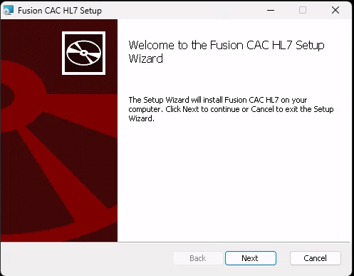
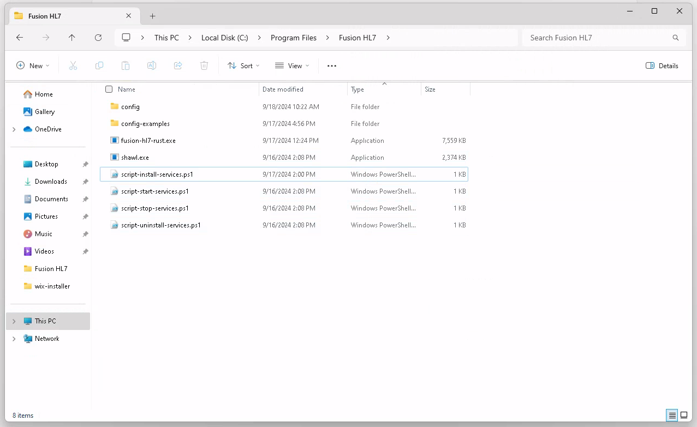

+++
title = "HL7 Installation"
weight = 10
linkTitle = "Installation"
+++

The Fusion HL7 Application is installed with a typical Windows Installer (msi) file.  The latest
version of the setup MSI is retreived and transferred by a Dolbey Technician from Dolbey's build 
server to the client site through a variety of file transfer methods depending on the client's 
VPN setup and security.

Double-clicking the installation program presents a typical Windows Installer UI and process.

> [!note] Windows Services
> Windows Services are **not** created by the installer for the hl7 listener.  They are created
> after configuration by running the included `script-install-services.ps1` script.  This is
> done so that each interface defined during configuration gets its own isolated Windows 
> Service that runs in isolation and can be started/stopped without disrupting other interfaces.
> 
> This is explored in detail in the configuration chapter.

Once the installation is complete, the application installation will have installed files to
the selected installation folder.

The installation folder will look like this:

